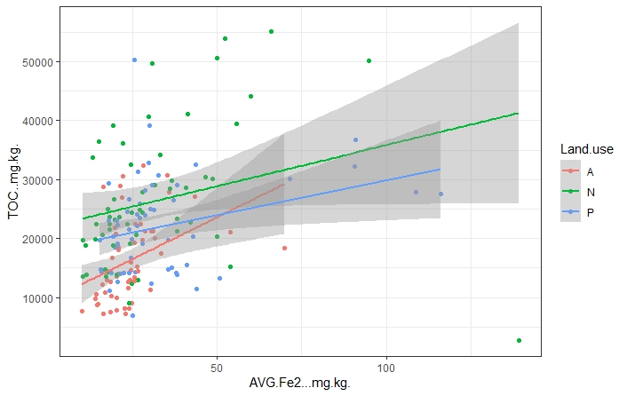

```{r setup, include=FALSE}
knitr::opts_chunk$set(echo = TRUE)
```

## Iron and soil organic carbon



This graph comes from data from over 168 soil samples collected across the state of Kansas in an attempt to look at the relationship between ferrous iron (Fe(II)) and total organic carbon concentrations (TOC), spanning several land use types (A= agricultural, N= Native, and P= Post agriculture).

